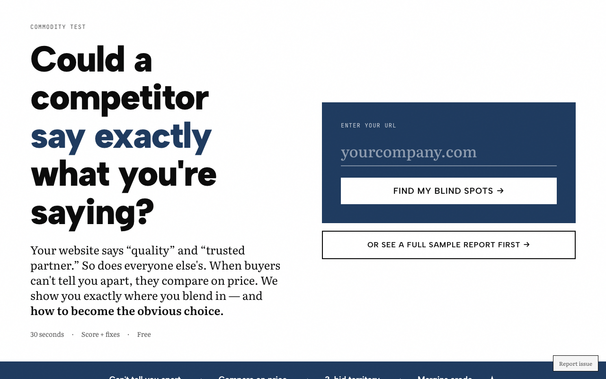
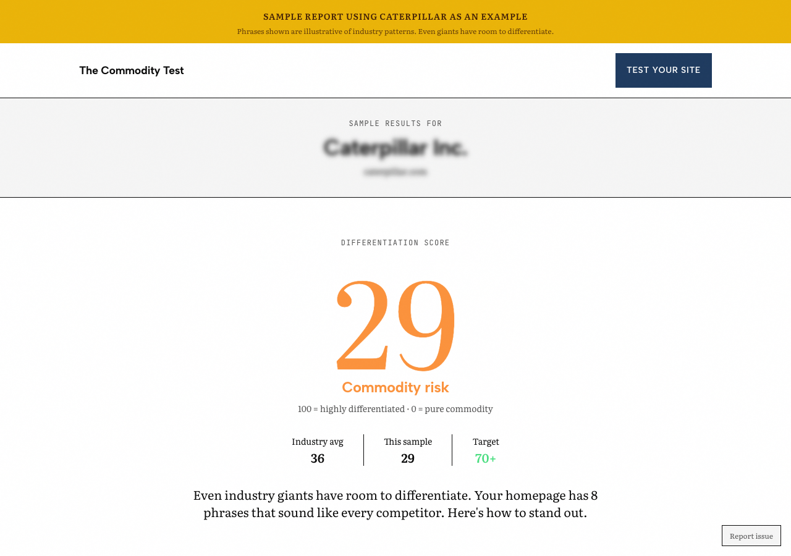
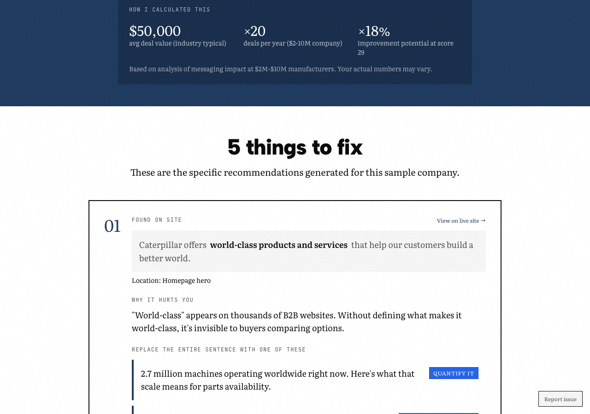

# The Commodity Test

**Find out if your website sounds like everyone else's.**

Most B2B websites use the same tired phrases: "innovative solutions," "customer-centric approach," "best-in-class." This tool analyzes your homepage and tells you exactly where you sound generic—and what to do about it.

🔗 **Live app:** [thecommoditytest.com](https://thecommoditytest.com)

---

## What it does

1. **Scrapes your homepage** using a multi-strategy approach (direct fetch → ScrapingBee → Jina AI) to handle bot protection
2. **Analyzes your messaging** against 140+ commodity phrases and patterns
3. **Scores your differentiation** on a 0-100 scale using bell curve distribution
4. **Identifies specific fixes** with before/after suggestions
5. **Estimates the cost** of generic messaging based on your industry

## Screenshots

### Homepage


### Results with score and cost estimate


### Specific fixes with before/after suggestions


## Tech stack

- **Next.js 14** (App Router)
- **Vercel KV** for result storage and rate limiting
- **Claude API** for intelligent phrase analysis
- **Tailwind CSS** for styling
- **Resend** for contact form emails

## Features

- 🎯 Industry-specific scoring (9 industries detected)
- 📊 Bell curve distribution for realistic scores
- 💰 Interactive cost calculator (customize your own deal values)
- 📱 Fully responsive design
- 🔗 Shareable result URLs with dynamic OG images
- 🛡️ Rate limiting (10/hr, 50/day per IP)
- 🤖 Anti-bot scraping with fallback chain
- 📧 Lead capture (guide downloads, result emails, contact form)
- 🔐 Admin dashboard with CSV export (`/admin`)

## Local development

```bash
# Clone
git clone https://github.com/lee-fuhr/commodity-test.git
cd commodity-test

# Install
npm install

# Set up environment
cp .env.example .env.local
# Add your API keys to .env.local

# Run
npm run dev
```

## Environment variables

```
ANTHROPIC_API_KEY=           # Required - Claude API
KV_REST_API_URL=             # Vercel KV (auto-populated on Vercel)
KV_REST_API_TOKEN=           # Vercel KV (auto-populated on Vercel)
SCRAPINGBEE_API_KEY=         # Optional - fallback scraper
RESEND_API_KEY=              # Optional - contact form emails
ADMIN_API_KEY=               # Optional - admin dashboard password
TODOIST_API_TOKEN=           # Optional - feedback to Todoist
TODOIST_FEEDBACK_PROJECT_ID= # Optional - Todoist project for feedback
```

## Related tools

- [Risk Translator](https://risk-translator.vercel.app) - Translate specs into risk language for purchasing approval

---

Built by [Lee Fuhr](https://leefuhr.com) • Messaging strategy for companies that make things
